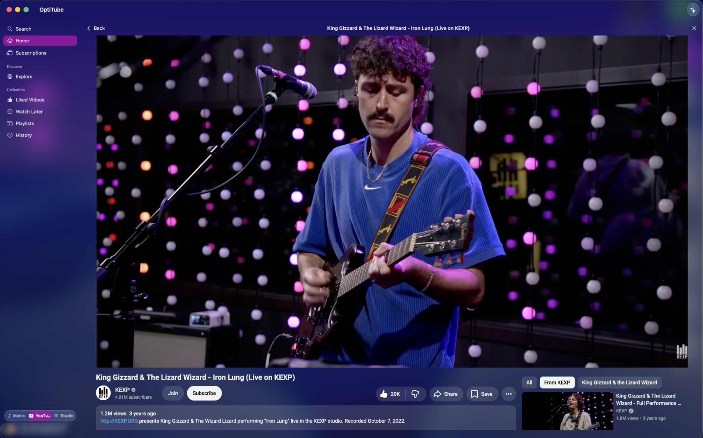
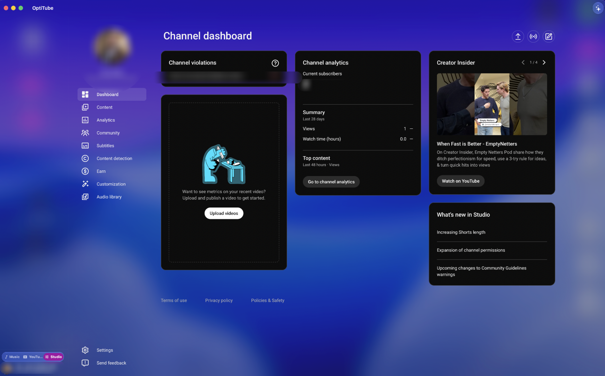

# OptiTube

A native macOS suite for YouTube Music, YouTube, and YouTube Studio — built with Swift and SwiftUI.

One window, three experiences. Flip between Music, YouTube, and Studio with a single toggle, wrapped in a translucent glass interface that feels at home on modern macOS.


<p align="center">
  
  
  
</p>

## Features

### Music

- **Native macOS Experience** — Apple Music-style UI with a Liquid Glass player bar and clean sidebar navigation
- **YouTube Music Premium Support** — Full playback of DRM-protected content via your existing subscription
- **System Integration** — Now Playing in Control Center, media key support, Dock menu controls, menu bar mini controller
- **Lyrics** — Synced lyrics with AI-powered explanations and mood analysis
- **Audio Equalizer** — Built-in EQ with presets
- **Queue Management** — View, reorder, shuffle, and clear your playback queue
- **Explore** — New releases, charts, moods & genres, and podcasts with episode progress tracking
- **Apple Intelligence** — On-device AI for natural language commands and playlist refinement
- **Scrobbling** — Last.fm support
- **Background Audio** — Music keeps playing when the window is closed; nothing auto-plays on launch

### YouTube

- **Full Video Mode** — Home, Subscriptions, Explore, Liked Videos, Watch Later, Playlists, and History as native feeds
- **Native Cards, Real Player** — Browse in fast native grids; watch with the genuine YouTube player, including comments and related videos
- **Channels and Playlists** — Click through to any channel or playlist directly in-app
- **Transparent Watch Surface** — The player page adopts the app theme instead of YouTube's flat background
- **AirPlay** — Send video to any AirPlay target via the native picker

### Studio

- **Full YouTube Studio** — The complete creator dashboard embedded in-app: upload, analytics, comments, monetization, customization, and audio library
- **Seamless Session** — Uses the same signed-in account as Music and YouTube; no separate login

### Everywhere

- **Themes** — OptiTube glass, OptiGlass, Nightshade (galaxy), and Darkness, applied across all three modes
- **Haptic Feedback** — Tactile feedback on Force Touch trackpads
- **[Keyboard Shortcuts](docs/keyboard-shortcuts.md)** — Full keyboard control for playback and navigation
- **[URL Scheme](docs/url-scheme.md)** — Open tracks directly with `optitube://play?v=VIDEO_ID`
- **[AppleScript Support](docs/applescript.md)** — Automate playback with scripts, Raycast, Alfred, and Shortcuts

## Requirements

- macOS 26.0 or later
- A [Google](https://accounts.google.com) account (sign in on first launch)

## Installation

Download `OptiTube.dmg` from the [Releases](https://github.com/VonKleistL/OptiTube/releases) page, open it, and drag OptiTube to Applications.

The app is not notarized. On first launch, right-click the app and choose Open, or clear the quarantine flag:

```bash
xattr -cr /Applications/OptiTube.app
```

## Building from Source

```bash
git clone https://github.com/VonKleistL/OptiTube.git
cd OptiTube
open OptiTube.xcodeproj
```

Build and run the `OptiTube` scheme with Xcode 26 or later.

## Documentation

- [Architecture](docs/architecture.md)
- [Playback](docs/playback.md)
- [Video Mode](docs/video.md)
- [Testing](docs/testing.md)

## Contributing

See [CONTRIBUTING.md](CONTRIBUTING.md) for development setup, architecture, and coding guidelines.

## Privacy

OptiTube talks only to Google/YouTube endpoints using your own signed-in session. Credentials live in the macOS Keychain and WebKit's storage on your machine — nothing is collected, proxied, or phoned home.

## License

MIT — see [LICENSE](LICENSE).

## Disclaimer

OptiTube is an unofficial application and not affiliated with YouTube or Google Inc. in any way. "YouTube", "YouTube Music" and the "YouTube Logo" are registered trademarks of Google Inc.
